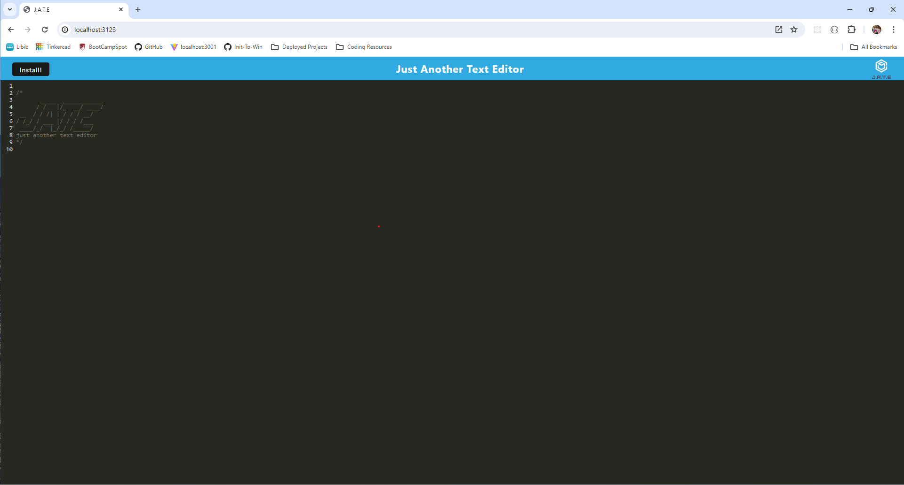
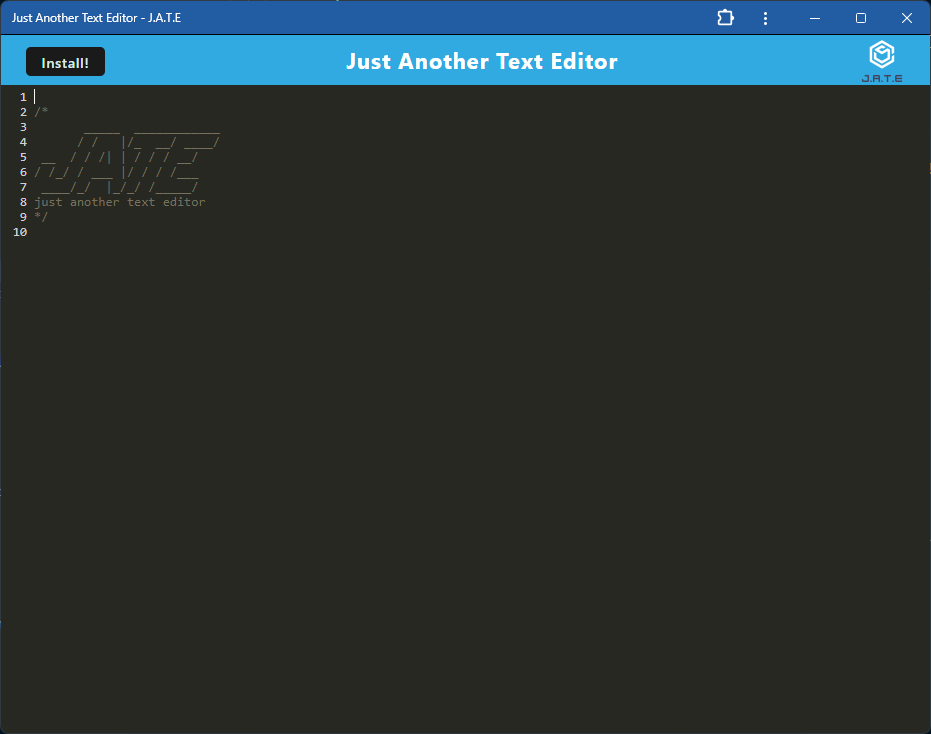

# PWA-text-editor

PWA text editor that runs in the browser.

## Description

This is a progressive web app that runs in the browser. This app can be installed on your desktop or mobile device, and used seamlessly between platforms. You can continue to use it while offline, and it will save your notes/text when you reconnect.

## Demonstrations

https://github.com/MelissaCade/PWA-text-editor/assets/160056156/d5ad3a28-a5f9-450f-8001-716ce9523c67

## Screenshots

Landing page of the browser app:

Opening Screen of the desktop app:

## Installation

After cloning the repository, run an 'npm i' in your terminal at the top level to initialize the node_modules for the overall project.

Once your initial 'npm i' has run, execute 'npm run install' in your terminal.

Now that all the various node modules have been installed at both the client and server level, execute 'npm run build' in your terminal to build your /dist folder.

To start the program, execute 'npm run start' in the terminal. You can now navigate to http://localhost:3123 in your browser. 

Once the page is open in the browser, you will see an "Install" button at the top left of the page. Click the "Install" button to install this app on your desktop. 

You can use this app either through the browser or through the desktop app.

NOTE: This app comes built with an "npm run start:dev" script, but there is an problem with webpack that produces an error message upon running this script and automatically launching the app. I suggest using the "npm run start" script and opening the application manually instead. This warning does not affect usage at all, and can be exited out of easily if you choose to use the "npm run start:dev" script. 

## Usage

Once you have installed and opened either the browser or desktop J.A.T.E. app, you can type notes, screenplays, to-do lists, or megamaniacal plans for global domination at your discretion. The app will save your work.

## Links

GitHub repository: https://github.com/MelissaCade/PWA-text-editor

## Credits

This page uses the materials and resources provided in the University of Denver Coding Bootcamp.

I also used the following websites as reference to figure out how to do everything:

stack overflow - https://stackoverflow.com/  
free code camp - https://www.freecodecamp.org/  
geeks for geeks - https://www.geeksforgeeks.org/  
mdn web docs - https://developer.mozilla.org/en-US/  
w3schools - https://www.w3schools.com/
